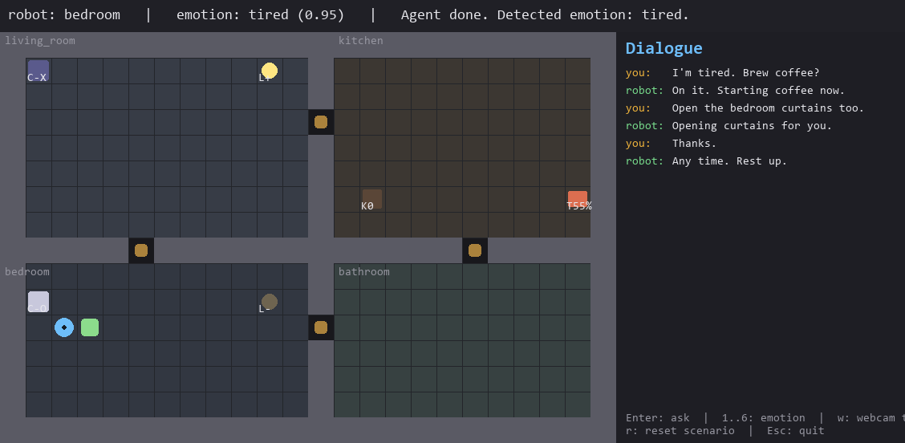

# HomeMate — Simulated LLM-Driven Home Companion Robot

MIE1077 (Artificial Intelligence for Robotics III) course project — University of Toronto, 2026.

HomeMate is a **fully simulated** home companion robot that integrates four cooperating modules:

| Module | Tech |
|---|---|
| **Vision (Perception)** | Real webcam + DeepFace facial-emotion recognition |
| **Cognition (LLM)** | Anthropic Claude (tool-calling loop) |
| **Planning** | A* over a grid, room sweep, LLM as high-level planner (ReAct-style) |
| **Robot Action + IoT** | Mock REST/MQTT-style IoT API + Pygame top-down rendering |

The robot lives in a 2D top-down apartment (kitchen, living room, bedroom, bathroom).
It can: search for its owner room by room, read the owner's emotion from a webcam,
hold an empathetic chat, and actuate smart-home devices (curtains, lamps, toaster,
coffee maker).

---

## Demo



A typical scenario, captured from the live Pygame UI:

- Robot (blue circle) is co-located with the owner (green square) in the **bedroom**.
- Owner's emotion is read from the real webcam — DeepFace reports **tired** at 0.95 confidence.
- HomeMate has actuated three IoT devices in response: **bedroom curtains open** (`C-O`), **living-room lamp on** (`L+`), and the **kitchen toaster cooking** at 55% progress (`T55%`).
- The dialogue panel on the right shows a short empathetic exchange ending with the robot saying *"Any time. Rest up."*

The screenshot is generated headlessly so it stays reproducible — anyone with the repo cloned can rebuild it:

```powershell
python -m homemate.scripts.snapshot
# writes docs/images/pygame_demo.png
```


## Quick start (Windows)

### 1. Install Python 3.10 or newer
Download from <https://www.python.org/downloads/windows/>. During install,
check **"Add python.exe to PATH"**.

Verify:
```powershell
python --version
```

### 2. Install dependencies

From the project root:
```powershell
python -m venv .venv
.\.venv\Scripts\Activate.ps1
pip install -r requirements.txt
```

> **Note:** `deepface` will download a few hundred MB of TensorFlow models on
> first run. This is expected. If you want a lighter install, see
> `requirements-minimal.txt` (no DeepFace — the system runs with a mock emotion
> detector that you can drive with keyboard keys 1–6).

### 3. Configure the Claude API key
1. Get a key from <https://console.anthropic.com/>.
2. Copy `.env.example` to `.env`:
   ```powershell
   copy .env.example .env
   ```
3. Open `.env` and paste your key after `ANTHROPIC_API_KEY=`.
4. Confirm the key works with a single tiny API call:
   ```powershell
   python -m homemate.scripts.live_check
   ```
   Expect `[OK] Claude is reachable and responding.` Costs roughly one cent
   of tokens.

### 4. Run the demo
```powershell
python -m homemate.main
```

You should see a 2D apartment window. The robot (blue) starts in the living
room; the owner (green) is randomly placed. Press **Enter** to give the agent
a goal in natural language, e.g. *"Find me and tell me a joke"* or
*"Open the bedroom curtains and start the toaster"*.

Keyboard shortcuts:
- `1`..`6` — manually inject an emotion (`happy`, `sad`, `angry`, `surprised`, `neutral`, `tired`) — useful when no webcam is attached.
- `w` — toggle real webcam emotion detection on/off.
- `r` — reset the scenario (re-randomize owner location).
- `Esc` — quit.

---

## Project layout

```
homemate/
├── main.py             # Pygame loop, UI, glue
├── config.py           # Constants, room sizes, palette
├── world/
│   ├── apartment.py    # Grid, rooms, walls, doors
│   ├── entities.py     # Robot, Owner
│   └── iot.py          # Mock IoT devices + REST-style API
├── perception/
│   └── emotion.py      # Webcam + DeepFace, with mock fallback
├── planning/
│   ├── navigator.py    # A* on the apartment grid
│   └── search.py       # Owner room-sweep policy
├── cognition/
│   ├── llm_agent.py    # Anthropic tool-calling loop (+ MockLLM)
│   └── tools.py        # JSON tool schemas + dispatch
├── memory/
│   └── store.py        # JSON-on-disk episodes + profile rollup
├── scripts/
│   ├── live_check.py   # Tiny one-shot Claude API connectivity check
│   └── snapshot.py     # Renders one Pygame frame headlessly to PNG (for the README)
└── action/
    └── skills.py       # Primitive skills the LLM can call
tests/
├── test_smoke.py       # End-to-end smoke test using MockLLM (no API key, no GUI)
└── test_memory.py      # Memory module tests (stdlib only)
```

---


## Roadmap (per proposal)

- **May 7 – May 28** Phase 1: 2D simulator + mock IoT + webcam + emotion — **done**
- **May 29 – Jun 18** Phase 2: Claude tool loop + A* nav + "find & greet" end-to-end — **code done; run `live_check.py` once you have an API key**
- **Jun 19 – Jul 9** Phase 3: emotion-aware dialogue, **memory (done)**, full IoT control, ReAct planner, 20 eval scenarios — *in progress*
- **Jul 10 – Jul 30** Phase 4: full evaluation + ablations + demo video + slide deck + Lecture 13 presentation


```powershell
python -m homemate.demo_cli sad "open curtains" --reset-memory   # wipe first
python -m homemate.demo_cli sad "open curtains" --no-memory      # don't record
```
